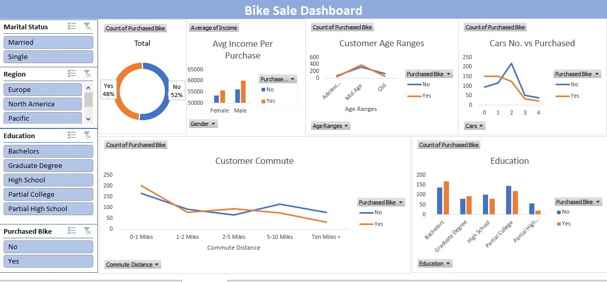
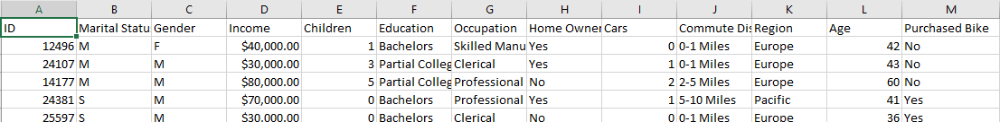
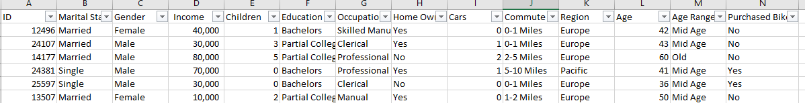

# Bike Sales Data Analysis

###  Overview
This project analyzes a **bike sales dataset** using **Excel** to uncover trends in customer demographics, purchasing behavior, and sales performance.  
The goal is to explore **what factors influence bike purchases** and to provide insights that could help improve marketing and sales strategies.

---

---
### About Data:
The data consist of 1000 record of people demographic data and wither they have a bike or no, and here is a snapshot of data:

### Data Cleaning and Preparation:
-	25 **duplicated** people data founded and deleted.
-	No **missing** values funded
-	**Standardized** variables of Gender and Marital Status (changed M/F to Male/Female and S/M to Single and Married)
-	The income format Changed to number instead of currency to avoid in calculation errors.
-	A new column (Age Range) create to **categories** the customer ages (Adolescent <31, Mid age >= 31, old >54)

snapshot for data after Cleaning and Preparation:

---

### Exploratory Analysis Performed:
-	Percentage of people who buy a bike to who didn’t.
-	The Average Income
-	Average of ages
-	Box-Plot for Income to detect outliers

---

### Visualization:
-	**Pie Chart**: Percentage of people who buy a bike to who didn’t.
-	**Line Char**t: Age Range and Purchased Bike
-	**Line Chart**: Commute Distance and Purchased Bike
-	**Bar Chart**: Marital status, gender and Purchased Bike
-	**Line Chart**: Children numbers and Purchased Bike
-	**Line Chart**: Car Number and Purchased Bike
-	**Line Chart**: Income and Purchased Bike

### Key Findings & Insights:
-	**Income is a strong predictor**: people with mid and low income are more likely to purchase a bike
-	**Middle aged** customer purchased a car more than others
-	**shorter commute** indicted more tendency to purchase bike.
-	Occupation & Education: Customers with **professional jobs and higher education** levels purchase bikes more frequently.
-	Gender and marital state: **Males** are slightly more likely to purchase a bike than females whatever the marital state.
-	 Children number: **negative relation** between children number and purchase bike chance.

### Tools Used: Excel and Pivot Tables
