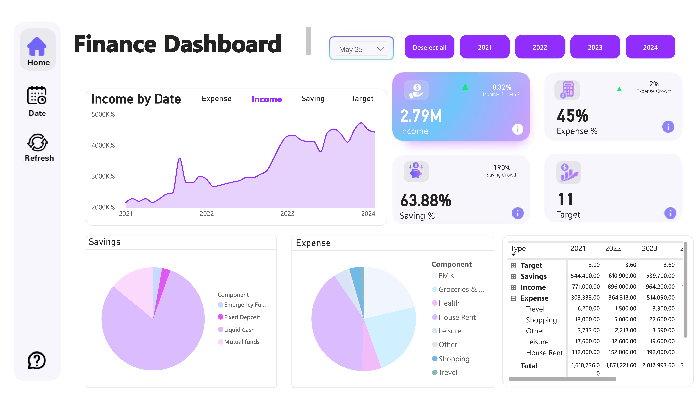
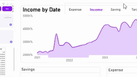
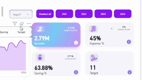

## Finance Analysis Project

## About Data
A 38-month money data set that represents Income, Savings, and Expenses. In this project, I tried to analyze the patterns of these three aspects and follow their growth with time.

## TOOLS:
- Power BI Check out the project file in BI format here:  [my link](money.pbix) 

### What are the New skills I learned from this project?
- How to make a dashboard with full color harmony.
- How to use a line chart and make its data dynamic like this:
- 

- How to visualize the growth and losses using arrows like this:
- 
