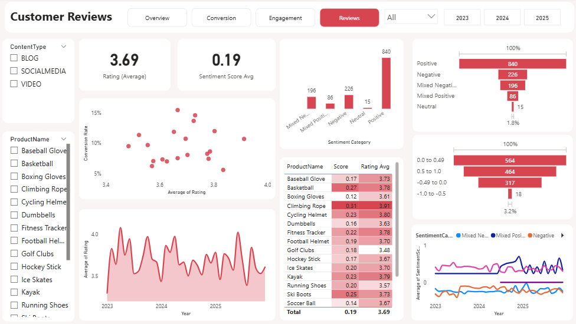

## Marketing Analysis Project
ShopEasy, an online retail business, is facing reduced customer engagement and conversion rates despite launching several new online marketing campaigns. They are reaching out to you to help conduct a detailed analysis and identify areas for improvement in their marketing strategies.

 
 
 
 

## Key Points:
•	Reduced Customer Engagement: The number of customer interactions and engagement with the site and marketing content has declined.
•	Decreased Conversion Rates: Fewer site visitors are converting into paying customers.
•	High Marketing Expenses: Significant investments in marketing campaigns are not yielding expected returns.
•	Need for Customer Feedback Analysis: Understanding customer opinions about products and services is crucial for improving engagement and conversions.

## Stakeholder Meeting:

#### Marketing Manager at ShopEasy: 
We’ve been facing some challenges with our marketing campaigns lately, and I’m reaching out to request your expertise in data analysis to help us identify areas for improvement. Despite our increased investment in marketing, we’ve observed a decline in customer engagement and conversion rates. Our marketing expenses have gone up, but the return on investment isn’t meeting our expectations. We need a comprehensive analysis to understand the effectiveness of our current strategies and to find opportunities to optimize our efforts. We have data from various sources, including customer reviews, social media comments, and campaign performance metrics. Your insights will be invaluable in helping us turn this situation around.

#### Customer Experience Manager at ShopEasy, and I’m writing to seek your help with analyzing our customer feedback. Over the past few months, we’ve noticed a drop-in customer engagement and satisfaction, which is impacting our overall conversion rates.
We’ve gathered a significant amount of customer reviews and social media comments that highlight various issues and sentiments. We believe that by thoroughly analyzing this feedback, we can gain a better understanding of our customers' needs and pain points.
Your expertise in data analysis will be crucial in helping us decode this feedback and provide actionable insights. We hope this will guide us in improving our customer experience and ultimately boost our engagement and conversion rates.

### Requirements 
#### Increase Conversion Rates:
**Goal:** Identify factors impacting the conversion rate and provide recommendations to improve it.
**Insight:** Highlight key stages where visitors drop off and suggest improvements to optimize the conversion funnel.

#### Enhance Customer Engagement:
**Goal:** Determine which types of content drive the highest engagement. 
**Insight:** Analyze interaction levels with different types of marketing content to inform better content strategies.

#### Improve Customer Feedback Scores:
**Goal:** Understand common themes in customer reviews and provide actionable insights.
**Insight:** Identify recurring positive and negative feedback to guide product and service improvements.
 
## Data
A database file MADB.Pak, Contains 6 Tables:
1-	Products
- ProductID	ProductName	Category	Price
- 1		Running Shoes	Sports	223.75

2-	Customers
- CustomerID	CustomerName	Email			Gender	Age	GeographyID
- 1		Emma Anderson	em @exl.com	Male		50	2

3-	Geography
- GeographyID	Country	City
- 1			UK		London

4-	Customer Journey
- JourneyID	CustomerID	ProductID	VisitDate	Stage		Action	Duration
- 1		64		18		2024-06-10	Checkout	Drop-off	156

5-	Customer Reviews
- ReviewID	CustomerID	ProductID	ReviewDate	Rating	ReviewText
- 1		77		18		2023-12-23	 3		Average  experience,  nothing  special.

6-	Engagement Data
- EngagementID  ContentID ContentType Likes EngagementDate CampaignID ProductID ViewsClicksCombined
- 1		     39	 Blog		190 2023-08-30	1	     9 		1883-671

This is our data structure with example.

## Data Cleaning and Preparation:

Download the  database recovery .bak from [Here](MADB.bak)

### SQL: 
[Checkput the Queries](SQL_Queries.sql)

1-	Products
Products categorized upon price: Low price <50, Medium Price between 50 and 200, and High price >200 
2-	Customers Table and Geography Table
customer data was completed by using the left join between the two tables on geographyID, the result we added country and the city to the user
3-	Customer Reviews
ReviewText Column standardized by ensuring the spaces between words (Replace two spaces with one space)
4-	 Customer Journey
To ensure the uniqueness of every journey, I used RowNumber() to achieve that. There were many null values for duration, so I used the average to fill these null values.
5-	  Engagement Table
Separate ViewClicksCombaind into two tables, convert content type to uppercase, and because social media is our main focus, we excluded the Newsletters content Type.

### Python: 
[Checkput the code](sentiments_analysis_script.py)

We were asked to **analyse sentiments**. Python is the best tool for this, because it contains a library called **NLTK** (Natural Language Tool Kit), and we will download the Vader Lexicon model to use it for sentiment analysis.
Another library, pyodbc used to connect Python to the database and gather customer reviews table.
After calculating the **sentiment score**, we categorized sentiments using the score and the customer rating as follows:
•	Positive: score >0.05 and rating >=4
•	Mixed Positive: score >0.05 and rating =3, or socre <-0.05 and rating>3
•	Mixed Negative: score >0.05 and rating <3, or socre <-0.05 and rating=3
•	Negative: score <- 0.05 and rating <=2
•	Neutral: score between 0.05 and -0.05 and rating 3

**Besides this we added another function to create a Sentiment Buckets:**
•	score >= 0.5:  '0.5 to 1.0'  # Strongly positive sentiment
•	   0.0 <= score < 0.5: '0.0 to 0.49'  # Mildly positive sentiment
•	-0.5 <= score < 0.0: '-0.49 to 0.0'  # Mildly negative sentiment
•	 '-1.0 to -0.5' 

After that, I used **pandas** to merge these three columns: score, category, and bucket. the new file was exported as a CSV file with the following formula:
- ReviewID	 CustomerID  ProductID  ReviewDate  Rating  ReviewText	SentimentScore	SentimentCategory	SentimentBucket
- 1	77	18	12/23/2023	3	xxxxxx.	-0.3089		Mixed Negative	-0.49 to 0.0

## Now we are ready to open POWER BI 

[Download Project]()
 
## Measures and Columns Created:
1-	Age Range Column Created 18-29, 30-40, 40-55, and +55
2-	Conversion Rate % (View/Purchased)
3-	Total visit
4-	Drop off % (Drop-off/total visits)
5-	Engagement Rate (Likes/Views)
6-	CTR - Click Through Rate (clicks/views)
7-	Average Rating
8-	Average sentiment score
9-	Number of Campaigns 

## The Dashboard Divided into 4 pages:
1-	Overview
2-	Conversion
3-	Engagement
4-	Review
