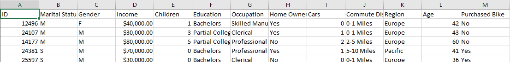

# Bike Sales Data Analysis

##  Overview
This project analyzes a **bike sales dataset** using **Excel** to uncover trends in customer demographics, purchasing behavior, and sales performance.  
The goal is to explore **what factors influence bike purchases** and to provide insights that could help improve marketing and sales strategies.

---
## About Data:
The data consist of 1000 record of people demographic data and wither they have a bike or no, and here is a snapshot of data:

##  Data Preparation
1. **Data Cleaning**
   - Removed duplicate customer records.  
   - Handled missing values in **income** and **age** fields.  
   - Standardized categorical variables (e.g., “Male/Female”, “Yes/No”).  

2. **Outlier Treatment**
   - Detected outliers in **income** and **age** using boxplots.  
   - Kept them in analysis since they represent real customer variation.  

3. **Data Transformation**
   - Created a new column for **Age Brackets** (Adolescent, Middle Age, Old).  
   - Grouped commute distances into categories (0–1 mile, 1–2 miles, etc.).  
   - Encoded categorical data for pivot analysis.  

---

##  Analysis Performed
- **Descriptive Statistics**: Average income, age distribution, commute distances.  
- **Segmentation**:  
  - By **gender**, **marital status**, and **children**.  
  - By **education** and **occupation**.  
- **Visualization**:  
  - Bar charts → Bike purchase rate by gender & marital status.  
  - Line charts → Income vs. bike purchase trends.  
  - Pie charts → Commute distance categories.  
  - Heatmaps → Bike purchase correlation with education & occupation.  

---

##  Key Findings & Insights
- **Income is a strong predictor**: Customers with higher income levels are more likely to purchase bikes.  
- **Middle-aged customers** showed the **highest bike purchase rate** compared to adolescents and older groups.  
- **Commute distance matters**: Customers with **shorter commutes (0–5 miles)** tend to buy more bikes.  
- **Occupation & Education**: Customers with professional jobs and higher education levels purchase bikes more frequently.  
- **Marital status and gender** have moderate influence compared to income and occupation.  

---

##  Tools Used
- **Microsoft Excel**: Pivot Tables, Charts, Conditional Formatting.  
- **Data Cleaning**: Filters, formulas, and logical functions.  
- Create an **interactive dashboard** in Power BI / Tableau.  
- Apply **predictive modeling** to forecast bike purchases.  
